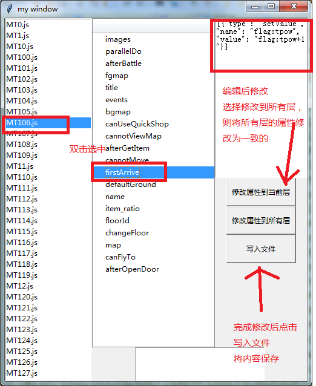
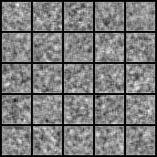
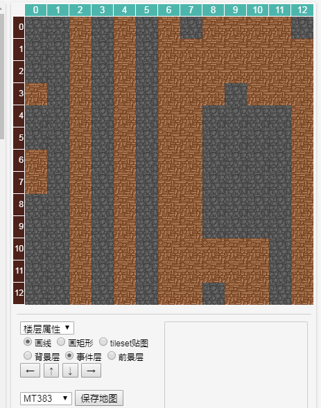

# HTML5魔塔编辑器工具集

HTML5魔塔样板地址：https://github.com/ckcz123/mota-js

## 目录结构

``` bash
├── /GANgen/         # GAN楼层生成 | 属性批量修改
│ ├─ /data/          # 训练和生成的数据
│ ├─ /info/          # 临时信息
│ ├─ dcgan.py        # GAN核心代码
│ ├─ imgs2txt.py     # 图片转txt数据
│ ├─ txt2img.py      # txt数据转图片
│ ├─ myDataSets.py   # 数据集接口
│ ├─ myFuncs.py      # 一些工具函数。
│ ├─ events.js       # 处理事件的文件，所有自定义事件都会在此文件中进行处理
│ ├─ towerInfo.py    # 读取塔信息
│ └─ usrgui.py       # 批量属性修改的gui
├── /FlowFreeGen/    # 连消楼层生成项目
│ ├─ /crawl_data/    # 爬取的原始数据
│ ├─ /data/          # 生成的楼层数据
│ ├─ crawl.py        # 爬虫程序
│ ├─ cluster.py      # 图像聚类程序（暂弃用）
│ └─ main.py         # 主程序
├─ /images/          # 所有图片素材目录
├─ /bin/             # 所有可执行二进制程序目录
└──── 楼层属性批量修改.exe
```
## 1 楼层批量属性修改

### 运行方法
1. 把工程目录下的/floors 复制到 data目录中
2. 直接运行 楼层属性批量修改.exe 或者：cd GANgen ; python usrgui.py

### 环境依赖(运行exe需要64位操作系统)
python 3.5

### 使用方法
如图：


！注意备份数据，如果由于数据格式不正确写入出错概不负责……


## 2 基于GAN的布局自动生成

### 运行方法
1. 把样板塔project目录下的/floors 以及 data.js 复制到 data目录中
2. 把需要模仿的工程目录复制到projects中（只需要保留floors即可），目前有三原塔
3. 运行： cd GANgen ; python main.py

### 环境依赖
python 3.5
pytorch 0.4.1

### 数据预处理与结果处理

目前的处理方式是取出所有编号0-10的图块作为墙，然后二值化为图片，放进dcgan中进行训练。
生成的图片（结果如下图）是0-255的灰度图，取中间一个阈值，高于阈值为墙，低于阈值为空地。



### 目前结果
目前生成的结果（以三原塔为训练集），生成的层的内容在data/floors下。目前只有墙，可以根据需求考虑加入自动生成每层处理事件、上下楼梯等。


部分在样板中效果截图：




生成效果不是太好，推测原因是特征粒度不够细，以及训练数据处理不当。等待进一步实验吧（咕咕）

## 3. 爬取FlowFree的样例并生成连消游戏


